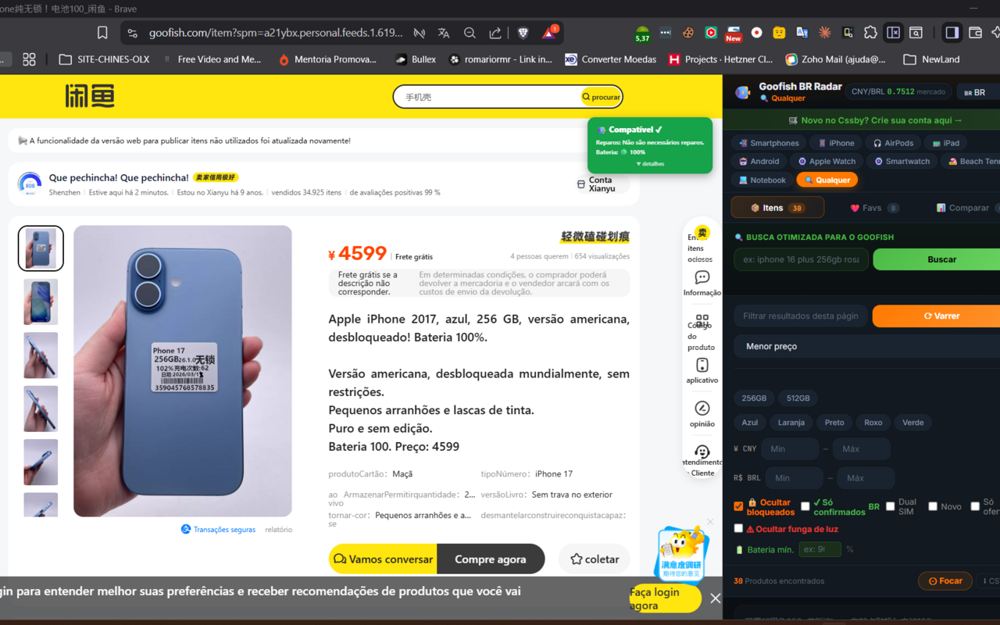
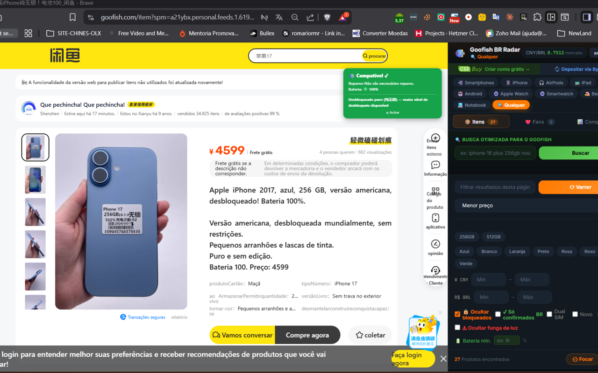
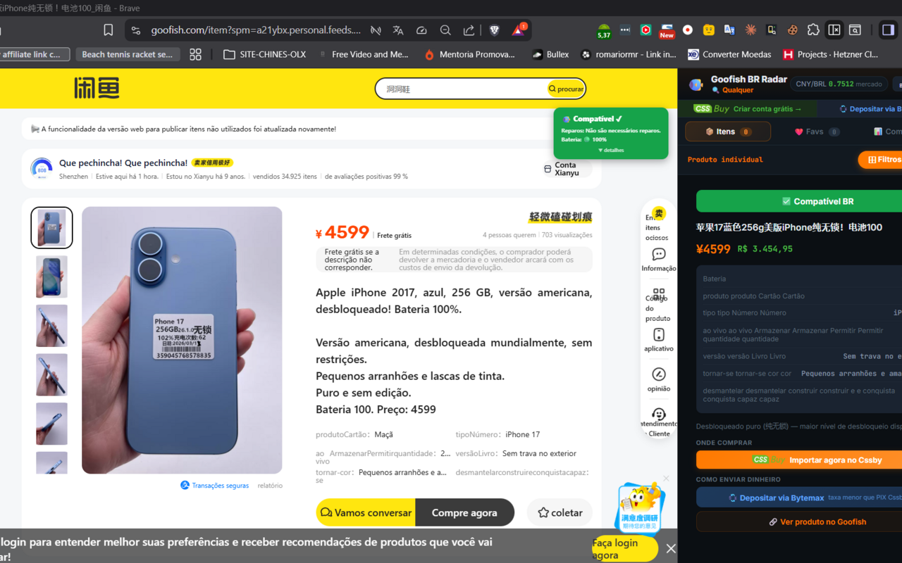

# Import Radar

> Extensão Chrome para compradores brasileiros no **Goofish (Xianyu/闲鱼)** da Alibaba.

Filtra produtos por perfil, verifica compatibilidade de rede com o Brasil, mostra preços em reais e gera links diretos para importação via CSSBuy.

---

## Instalar na Chrome Web Store

**Compatível com Chrome e Brave.**

---

## O que faz

### Filtros por perfil de produto
Perfis pré-configurados para cada categoria:

| Perfil | O que filtra |
|--------|-------------|
| 📱 iPhone | Modelo, storage, cor, compatibilidade de rede BR (Band 28), carrier lock, dual SIM |
| 🤖 Android | Marca, modelo, compatibilidade BR |
| ⌚ Apple Watch | Série, tamanho, GPS/Cellular, eSIM BR |
| ⌚ Smartwatch | Marca, modelo (Garmin, Huawei, Samsung, Xiaomi…) |
| 🎾 Beach Tennis | Marca (Babolat, NOX, Head, CAMEWIN…), exclusão de falsos positivos |
| 💻 Notebook | Marca, modelo, storage, RAM |
| 🔍 Qualquer | Busca livre |

### Compatibilidade de rede
Para iPhones, verifica o modelo **A-number** contra a tabela oficial Apple — confirma suporte ao **Band 28 (700 MHz)** usado pelas operadoras brasileiras. Funciona para 500+ modelos.

### Detecção de bloqueio por operadora
Detecta automaticamente iPhones bloqueados por operadora (有锁, carrier lock, SIM Bloqueado) e os marca com 🔒 — filtre para ocultar todos de uma vez.

### Preço em reais em tempo real
Conversão CNY → BRL com taxa de mercado (Frankfurter) ou taxa customizada (ex: taxa CSSBuy). Filtro por preço mínimo e máximo em BRL ou CNY.

### Watchlist — Itens e Lojas Salvos
Salve produtos para comparar depois e monitore lojas favoritas — tudo dentro da extensão, sem precisar dos favoritos do navegador.

### Link direto para importação
Botão **"Importar agora"** em cada card leva direto ao CSSBuy com o produto mapeado — plataforma que recebe o produto na China e envia ao Brasil.

### Deep scrape de detalhes
Após varrer a listagem, a extensão busca a descrição completa de cada produto para detectar informações que só aparecem no anúncio individual (carrier lock, versão americana, etc.).

### Tradução automática PT-BR
Specs e descrição traduzidos automaticamente para português.

### Monitor de vendedores
Configure alertas por modelo, storage, cor e preço máximo. A extensão monitora automaticamente os vendedores salvos e notifica quando encontra correspondência.

---

## Screenshots

---

## Instalação manual (modo desenvolvedor)

Se preferir instalar sem a Chrome Web Store:

1. Baixe o zip da [última release](https://github.com/romariormr/import-radar/releases/latest)
2. Extraia em uma pasta
3. Abra `chrome://extensions` e ative o **Modo do desenvolvedor**
4. Clique em **Carregar sem compactação** e selecione a pasta

> Usando a Chrome Web Store você recebe atualizações automáticas — recomendado.

---

## Privacidade

A extensão não coleta dados pessoais, não faz login e não envia informações para servidores externos.
Veja a [Política de Privacidade](https://romariormr.github.io/goofish-privacy/).

---

## Suporte

Encontrou um bug ou tem uma sugestão? Abra uma [issue](https://github.com/romariormr/import-radar/issues).
